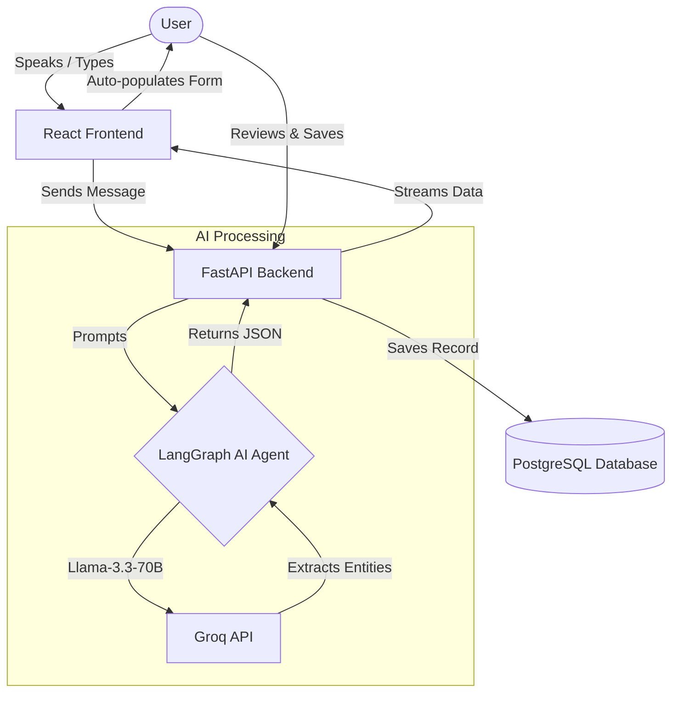

# AI-First CRM (HCP Module)

An AI-powered CRM system where users log interactions with Healthcare Professionals (HCPs) using a conversational interface and local voice AI transcription instead of manual form filling.

## Architecture
- **Frontend**: React + Vite + Tailwind CSS 4 + Redux
- **Backend API**: FastAPI (Python compatible)
- **Database**: PostgreSQL (Dockerized) + SQLAlchemy
- **AI Agent Built with LangGraph (Groq)**: The core AI brain uses `llama-3.3-70b-versatile` under the hood via LangChain, employing five core tools:
  1. `Log Interaction Tool`: Extracts structure (Name, Date, Notes, Sentiment, Products).
  2. `Edit Interaction Tool`: Modifies specific fields of an interaction.
  3. `Suggest Next Action Tool`: Analyzes context to recommend follow-ups.
  4. `Summarize Interaction Tool`: Condenses long notes into summaries.
  5. `Fetch Interaction History Tool`: Retrieves past records for the HCP.

## Key Features
- **Conversational UI**: Enter natural language to automatically fill CRM data.
- **100% Local Voice-to-Text**: Integrated in-browser Whisper transcription for seamless spoken updates without sending audio data to the cloud.
- **Persistent Interaction History**: A side drawer interface to easily view, manage, and retrieve past HCP interactions stored securely in PostgreSQL.
- **Intelligent Auto-population**: Redux seamlessly streams AI-extracted entities from the LangGraph backend and dynamically populates the CRM layout.

## Quick Start

### 1. Database Setup
Ensure you have Docker and Docker Compose installed.
```bash
docker compose up -d
```
*(This starts the PostgreSQL instance on port 5433 with the required credentials)*

### 2. Backend Setup
Create an environment file:
```bash
cd backend
cp .env.example .env
# Edit .env and set your GROQ_API_KEY
```

Run the FastAPI Application:
```bash
# Create a virtual environment
python -m venv venv

# Activate the virtual environment
# Windows:
venv\Scripts\activate
# Mac/Linux:
# source venv/bin/activate

# Install dependencies
pip install -r requirements.txt

# Start the application server
uvicorn main:app --reload
```
*(The backend API will run on http://localhost:8000)*

### 3. Frontend Setup
Open a new terminal window:
```bash
cd frontend
npm install
npm run dev
```
*(The frontend React app will be accessible via your localhost address shown in the terminal)*

## Visual Working Flow


